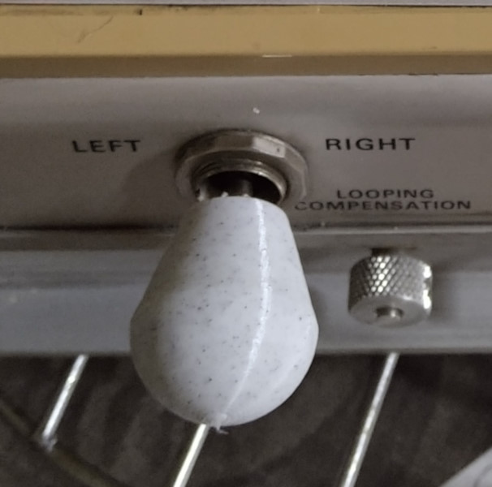
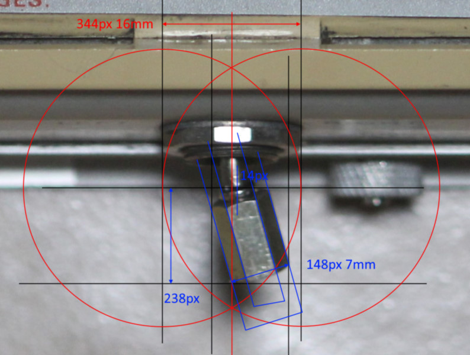
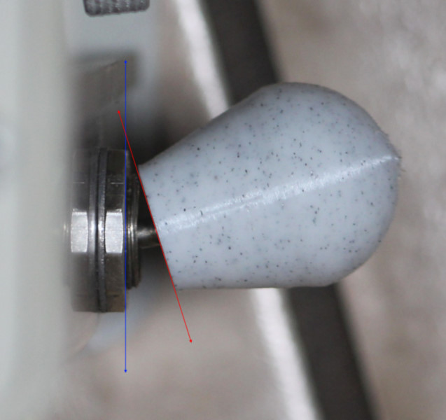
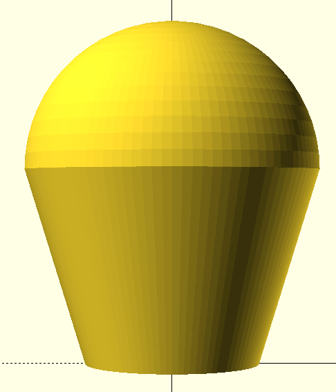
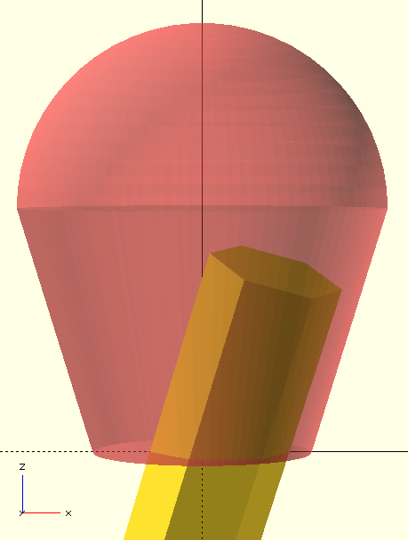
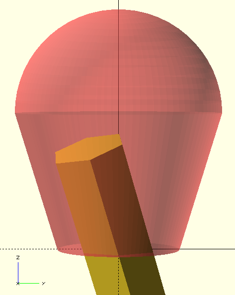
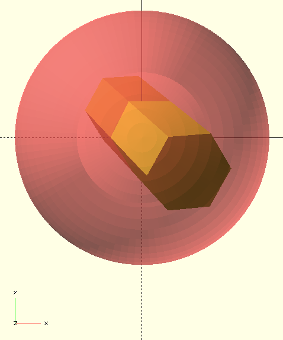

# Tek Toggle Cover

# Problem
The toggle stem was severely bent... The idea was to cover it up to make it appear straight.

# Ideas
My dad's original idea was to create a two piece sandwich. I thought I might as well attempt to cover everything with one piece. Originally we wanted to be a rectangular shape... Though my dad wanted a circular shape with a taper instead.

# Process
I took photos to measure the angle and the offset. The first prototype was too loose... However the angle seemed correct. The second prototype was a little loose... It really confirms the angle is correct. For the third prototype, I decided to tighten it further as well as correct the angle vertically... It was surprisingly simple. Correcting the fit is really measuring the actual fit and subtracting the outer dimension of the stem. (Error = Actual - OD.) I still don't really understand inner measurements... But outer measurements with a caliper seems true.

# Measurements

A top down photo. The angle and offset is measured.

Testing the second prototype. The side angle is measured.

# OpenScad Drawing

The final shape.

The side views and top down view showing the location of the stem.

Front view.

Left view.

Top view.

# Solution
- Take pictures to measure angles.
	- Use a long lens to take photos from a far enough distance.
	- Straighten photo and take measurements.
- Draw in OpenScad
	- Draw stem profile, linear extrude.
	- Draw shape profile, rotate extrude.
		- Trapezoid shape with polygon
		- Circle shape
	- Center stem profile.
	- Rotate stem profile in both axis separately.
	- Subtract the two volumes.
	- Generate STL
- Generate GCode using Cura
- Print prototype.
	- Measure prototype for error.
	- Subtract error in OpenScad.
- Iterate until success.

Surprisingly simple. Success on third print. Use step height of 0.15mm for a fairly smooth finish. Each print takes around an hour.
