# Tek Feet

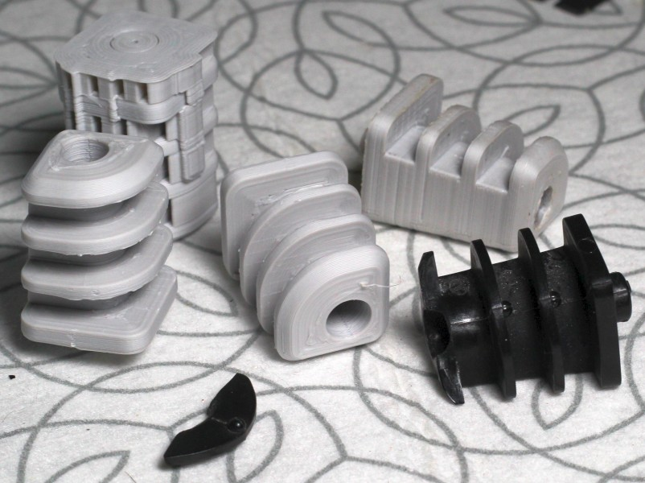

# Introduction

Yet another commission for Tek parts. Though having questionable design, this gives me an opportunity to draw them in OpenScad.

# Issue

The weak point in the original design is the corner where the feet meets the floor. The thickness between the outside and the screw hole wall is quite thin. This can be seen when viewing the wire frame model.

The horizontal cutouts are meant for the power cable to wrap around the feet.

# Modeling Process

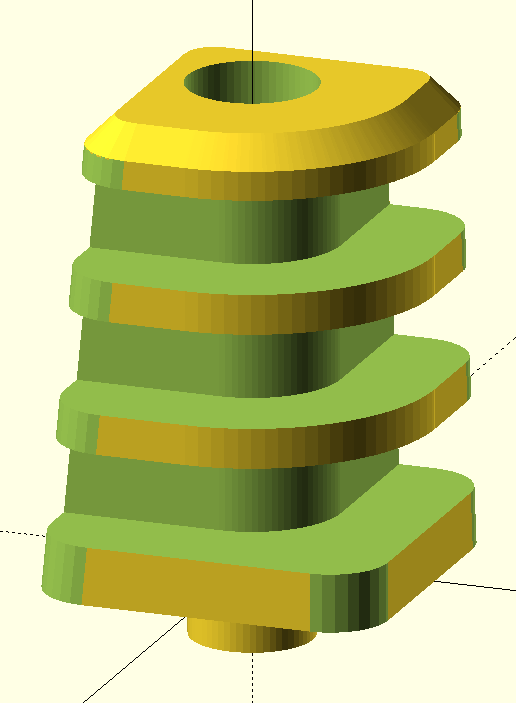

There are a lot of minute details to model out. In the OpenScad script, I breakdown the model into multiple parts and build them up feature by feature. As part of the process, I work on the major elements first then "chip" away to build the details.

## Base (Part A)

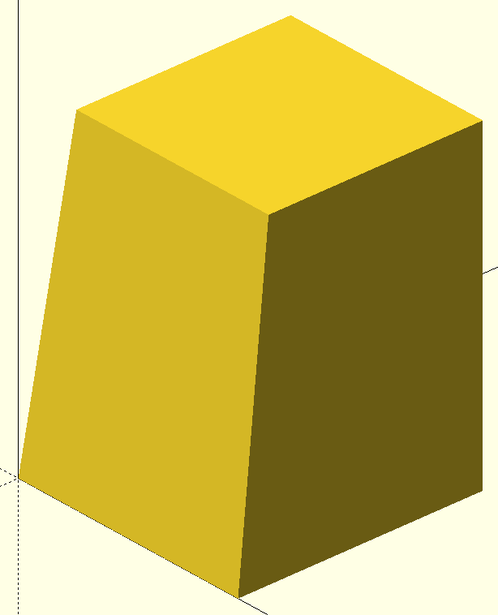

Starting off, the feet is a pyramid shape. It's beveled on two sides while the other two sides are at 90 degree angles. The measurements are roughly correct. The easiest way is to simply use the ```polyhedron``` module.

## Cylindrical Cutout (Part B)

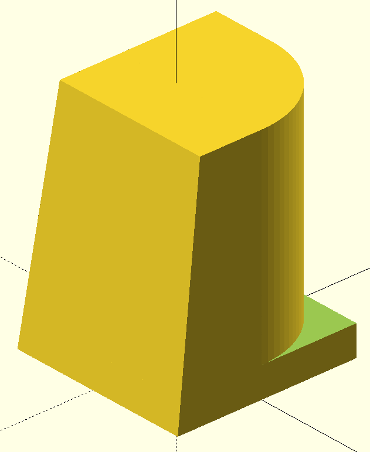

Next is carving out the cylindrical shape. A negative was made to remove from the base pyramid shape.

## Cylindrical Edges (Part C)

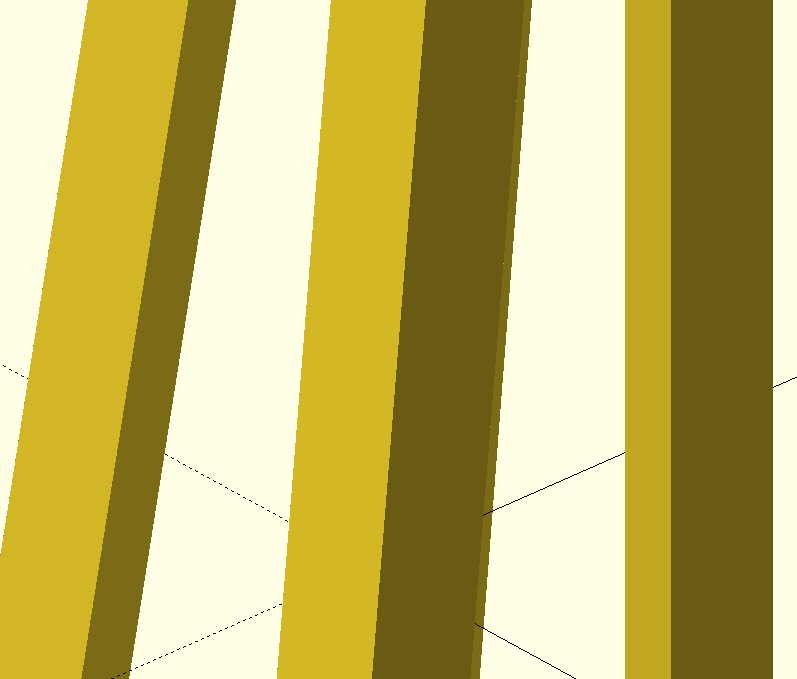

The feet features rounded side edges. As usual, a negative is modeled first. These are made using long cylindrical pipes rotated at the right angle. The rotations are surprisingly straight-foward.

## Cap Shape (Part D)

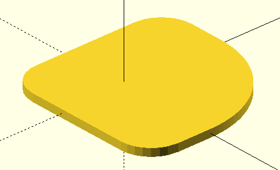

I remodel the cap shape in order to create a bevel.

## Beveled Cap (Part E)

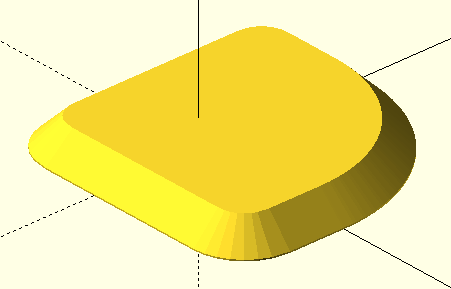

This is a trick using the ```hull``` command. Sometimes it works, sometimes it doesn't. For convex shapes, it should work. This creates a bevel as you would expect.

## Putting Everything Together (Part F)

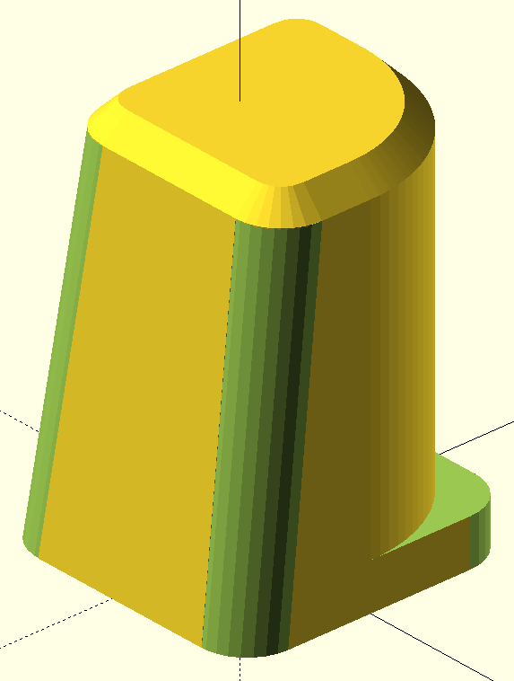

Simply putting things together. The shape now looks more refined and smooth.

## Cable Cutout (Part G)

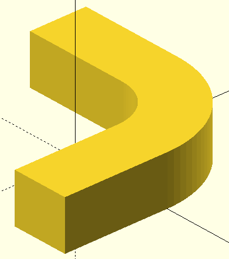

These are the slots for the cable cutout. Fairly straight-forward. Managing the details can be a little tough.

## Outer Shape (Part H)

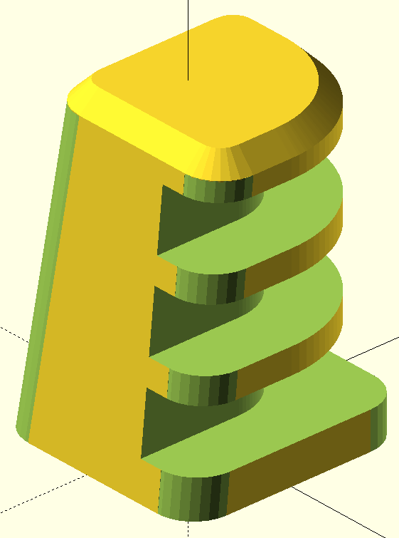

Part G is duplicated and subtracted away to form the final outer shape.

## Screw Holes (Part I)

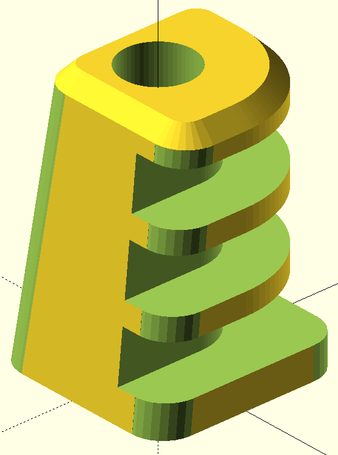

Finally the screw holes are added. Any hole where a screw shaft meets, I would opt to model a pilot hole instead. Screw shaft holes require low tolerances. These should be done by drilling. Furthermore, small feature sizes are hard to control due to the expansion and contraction of hot plastic.

# Iteration (Debugging)

I try to not rely on supports whenever I can. In this case, it's unavoidable. I printed the model in the same direction as I modeled it; The large base at the bottom while the smaller end on top. Removing supports from a hole would be challenging so I put the screw hole on top. Generally the Z-axis would be weaker due to layer adhesion. While the X-Y axis is strong since the plastic filament is aligned in the X-Y direction. Parts can be "recast" by using some sort of sand to surrond the part while remelting the part. (With the part forming its own shape.)

Anyways, only the screwhead size was too small. So a measurement was made then the difference was added back into the model. In this case, the model was good on the second try. I used my usual print settings, I base my print settings from another similar print.
