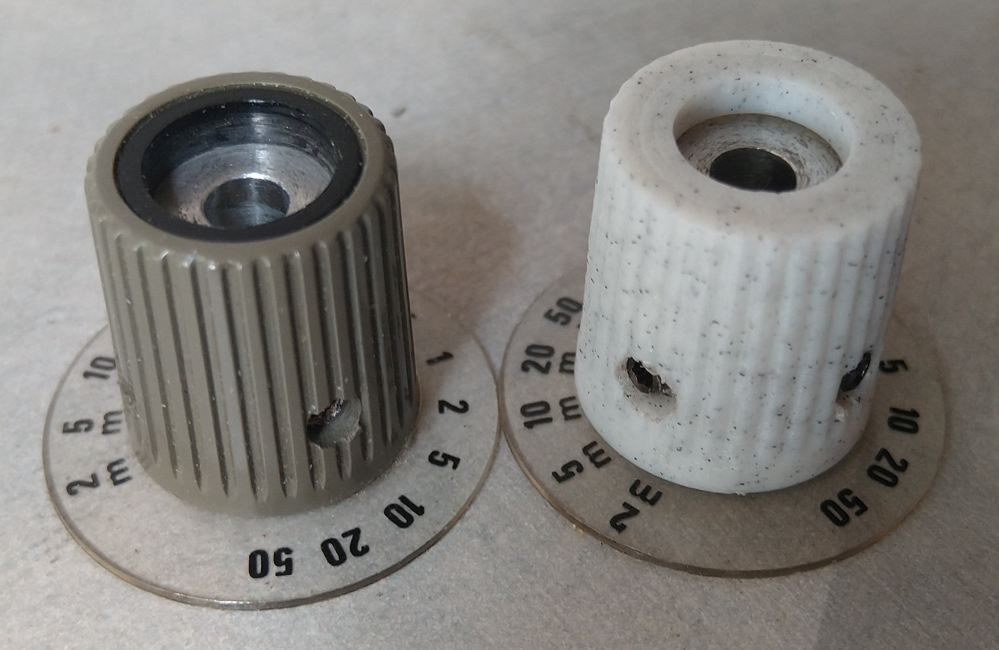
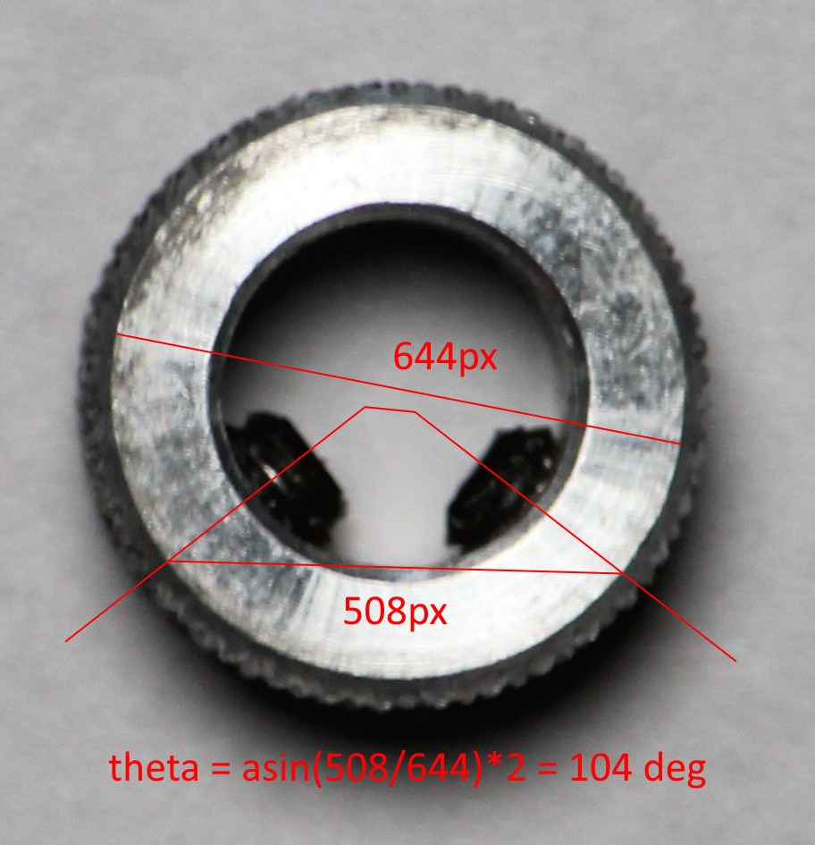
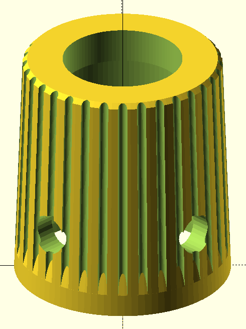

# Tek 475 Turn Knob

# Problem

My dad wanted a replica to replace the original broken one. Luckily there is a spare to refer to.

# Process

To make the process faster, I took measurements with a caliper and directly draft in OpenScad. I need to make sure I remember what each measurement is for...

Usually I would take a photo from a significant distance to reduce the effect of perspective. Another idea is to scan the item if possible.

For the first print, the walls were too thin so the print failed. Presumably, this could be reason why the original plastic broke. Thus I simply increased the size by 1mm.

Luckily, the second print went well. The collar area needed a bit of sanding while the holes needed to be drilled at a larger diameter.

I should have checked the angles of the holes. It's not perfectly at 90 degrees. Measuring from a photo, it seems to be 105 degrees...

# Measurements

# Design

