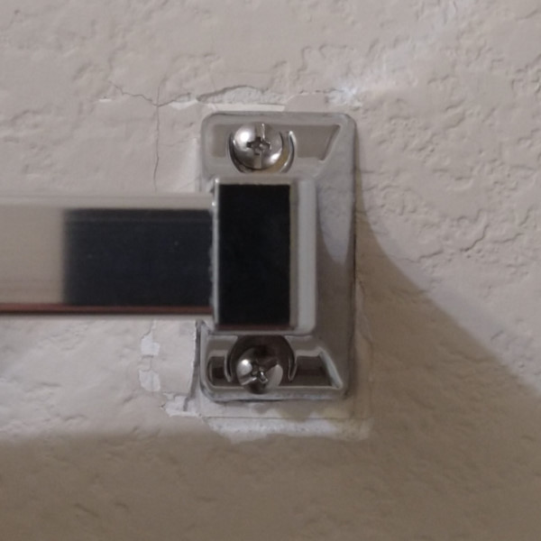

# Towel Bar Plate

## Problem

As you can see the towel bar "bracket" is digging into the wall and causing cracks to form. To my fault, I should have tighten the screws when it came loose. Regardless, I wanted to distribute the forces of the bracket as well as hide those cracks.

## Measurement

The first step is simply measuring all of the distances. The camera is quite a good measurement device, at least for measuring relative distances. (In theory, a "calibrated" camera can measure absolute distances if the distance to the object is known.) Anyways, the features I needed to measure were quite simple and I didn't really need that much accuracy.

Give or take, using inches makes more sense here... I would measure the width and height of the bracket using a ruler. Then in the photo, I would calculate the other distances using the measured pixels.

## Design

For the first version, I knew there had to be some gap between the outer part and the wall. For the screw holes, I thought I should reinforce it... But it was a bad idea. Of course, it should be printed with 100% infill. The plate shouldn't be too thick. Generally for screw holes, I would create a pilot hole. I think it's better to do final sizing by drilling out the holes. Though this print is quite simple, dimensioning holes can be difficult... I think it's due to holes simply requiring tighter tolerances. (Especially if you're trying to use the hole to install screws into.)

After printing out version one, the gap from the wall was horrendous. 2~3mm gaps. Well, I did think about it... I reference my design from lightswitch plates. However, I added in thickness for the screw holes... Thus for the second version, I removed those reinforcements, added more gap, and added in a chamfer.

Just a note, adding a chamfer is easy by using the hull function.

## Result

It looks okay. At least the cracks aren't visible...
